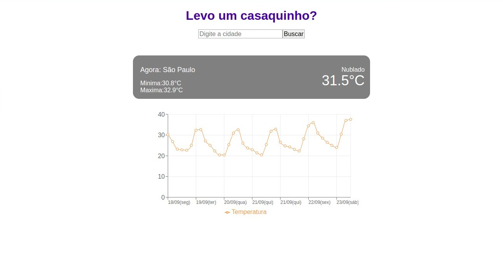

# Weather Forecast Web

A simple application to fetch weather information for cities.



## Description

One of the main concerns for those planning a trip is knowing what type of clothing to bring, depending on the weather conditions at the destination. The Weather Forecast Web is a practical solution that allows users to quickly check the weather information for a city, including the current temperature, maximum and minimum temperatures, and the forecast for the upcoming days.

## Technologies Used

- React
- TypeScript
- Vite
- Recharts (for chart visualization)
- Styled Components (for styling)

## Features

- Search for weather information by city name.
- Display current temperature, maximum, and minimum temperatures.
- Visualize weather forecasts for the upcoming days in a chart format.

## Deploy Vercel

1. Access on

   https://teste-tecnico-omega.vercel.app/

## How to use on your machine

1. Clone this repository:

   ```bash
   git clone https://github.com/Marcelovmendes/teste-tecnico

   ```

2. Install Dependencies:

```bash
 npm install
```

3. Start the Development Server

```bash
npm run dev
```

## What to do when add new ENV VARIABLES

1. Add them to your local `.env`
2. Follow guide `.env.example`

## Prettier format setup

1. Add new file to root directory `.vscode/settings.json`

```bash
{
  "editor.codeActionsOnSave": {
    "source.fixAll": true
  },
  "files.eol": "\n",
  "editor.defaultFormatter": "esbenp.prettier-vscode",
  "[javascript]": {
    "editor.defaultFormatter": "esbenp.prettier-vscode"
  }
}
```

2. Add new file to root directory `.prettierrc.json`

```bash
 {
  "semi": true,
  "trailingComma": "all",
  "singleQuote": true,
  "printWidth": 90
}
```

# Author

Marcelo Vitor Mendes

marcelo.vitor@engenharia.ufjf.br
